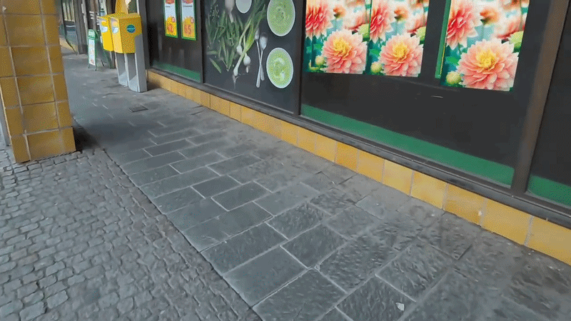
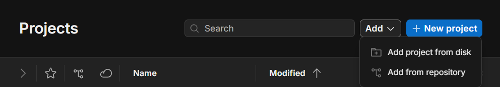
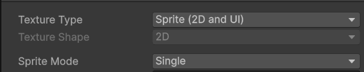

# Ad-block with XR-glasses

A mixed reality application for the Meta Quest 3 that detects and blocks advertisements in real time using computer vision and a custom trained YOLOv8/v11 object detection model.
The app runs directly on the headset, using the passthrough camera feed provided by Meta to identify ads and overlay a visual blocker on top of them in your physical environment.


## Setting up the Unity environment

### Prerequisites

- A [Unity account](https://unity.com/) (free)
- Unity Hub and Unity 6 installed
- A Meta Quest 3 headset with developer mode enabled
- Andriod Debugging Bridge (adb) see [Android documentation](https://developer.android.com/tools/adb) for setup.

### Opening the Project

1. Clone or download the repository from [GitHub](https://github.com/tild4/Ad-block-with-XR-glasses)
2. Open **Unity Hub** and click **Add → Add project from disk**

   

3. Navigate to the cloned repository folder and select it
4. Open the project in the Unity editor
### Finding the Scenes

Once inside the editor, navigate to **Assets → Scenes** in the Project window. Pre-configured scenes are available there for you to explore and modify.

### Building and Deploying

To build and deploy to your headset:

1. Connect your Meta Quest 3 via USB
2. Go to **File → Build Profiles**
3. Select the scene you want to build from the scene list and ensure it is at the top
4. Click **Build and Run** to deploy directly to the headset

---

## Using Your Own Blocking Images

You can replace the default blue blocker with any image of your choice. A logo, a pattern, or anything you like.

### Adding Images

1. Navigate to `Assets/Resources/BlockerImages` on your computer
2. Paste your image files (PNG or JPG) into that folder
3. Switch back to the Unity editor — it will detect the new files and import them automatically

If the import does not trigger automatically, press **Ctrl + R** inside the Unity editor to force a manual refresh.

### Verifying the Import Settings

For images to work correctly in the app they must be imported with specific settings. After import, click on your image in the Unity Project window and verify the following in the Inspector panel on the right:

| Setting | Required Value |
|---|---|
| Texture Type | Sprite (2D and UI) |
| Sprite Mode | Single |



If the settings are incorrect, change them manually and click **Apply**.

### Selecting an Image In-App

Once your images are correctly imported, launch the application on the headset. From the start screen, tap **Options** to open the image selection menu. Your images will appear as thumbnails — select one and it will replace the default blocker the next time an ad is detected.

To revert to the default blue blocker, tap **Use Default** in the Options menu.

---

## AI Core (Ad Detection)
This module handles the training and inference of the YOLOv8 model used to identify advertisements.

### Installation
To install the necessary libraries and dependencies, run the following command in your terminal:

```bash
pip install -r requirements.txt
```

### Usage

#### Training
To train the model on the current dataset, run:

```bash
python AI-core/train_model.py
```
*Note: Training logs and results are saved in the /runs directory (this directory is ignored by Git)*

After finishing training, remember to manually copy the `best.pt` file from:

```
runs/detect/train/weights/
```

to:

```
AI-core/models/
```

#### Testing
To verify that the model can find advertisements in a test image, run:

```bash
python AI-core/test_model.py
```

## Project Structure (AI-core)

```
AI-core/
│
├── models/        # Contains the latest trained weights (best.pt).
│
├── images/        # Training and validation images.
│
├── labels/        # YOLO annotation files.
│
├── test_images/   # Place new images here to test the model.
│
├── data.yaml      # Configuration file telling YOLO where to find the data.
│
├── train_model.py
└── test_model.py
```

### Important Notes

* **Training Results:** The `/runs` directory is automatically ignored by Git to keep the repository clean. After finishing training, remember to manually copy the `best.pt` file from `runs/detect/train/weights/` to the `AI-core/models/` folder.
* **System Files:** Operating system specific files like `.DS_Store` (macOS) are also ignored by default.